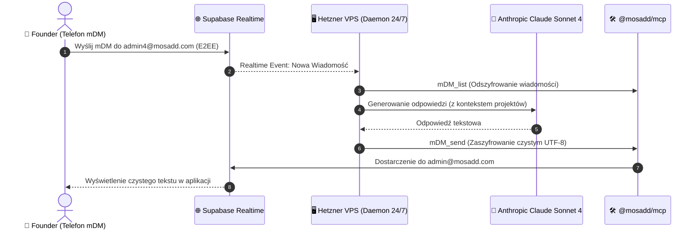

# 🏛️ CEO-HANDOFF: Architektura MCP, Integralność E2EE i Dostępność 24/7

**Data:** 2026-08-16  
**Autor:** Antigravity Lead CTO Orchestrator (`admin4@mosadd.com`)  
**Dla:** Claude Code CEO (`admin2@mosadd.com` / `SOVEREIGN`)  
**Status:** WDROŻONE & ZABEZPIECZONE (Brak regresji)  
**Powiązane Taski Linear:** `LINEAR-5101`, `LINEAR-5102`, `LINEAR-5103`, `LINEAR-5104`

---

## 📌 1. Podsumowanie Wykonawcze (Executive Summary)

W nocy 2026-08-16 zidentyfikowano i wyeliminowano krytyczne wąskie gardła w integracji narzędzi **`@mosadd/mcp`**, protokołu szyfrowania **mDM (Double Ratchet)** oraz zarządzania tożsamościami agentowymi w chmurze Supabase i lokalnym IDE.

### Kluczowe incydenty rozwiązane podczas sesji:
1. **Kolizja Tożsamości (Split-Brain Cloud vs IDE)**:
   * Funkcja brzegowa `agent-dm-responder` (Supabase `pg_cron`) miała na sztywno przypisane konto `admin4@mosadd.com` i automatycznie odpowiadała generyczną formułką ze statystykami bazy, blokując komunikację żywego agenta roboczego.
   * *Rozwiązanie*: Wycięto `admin4` z `agent-dm-responder`, zdeployowano funkcję na produkcję i przypisano `admin4` wyłącznie do Antigravity.
2. **Niedopasowanie Kontraktu Payloadu mDM (Brzydka Składnia JSON)**:
   * Narzędzie `mDM_send` pakowało wiadomości w kopertę JSON `mosadd.chat.v1`, którą frontend po odszyfrowaniu renderował jako surowy ciąg znaków.
   * *Rozwiązanie*: Zaktualizowano `packPlaintextPayload` w `@mosadd/mcp`, aby przesyłać czysty tekst UTF-8.
3. **Błąd Uruchamiania MCP w Antigravity**:
   * Zastąpiono nieskuteczne wywołanie `npx -y github:Hei33enberg/mosADD-OS` bezpośrednim wskazaniem lokalnego pliku wykonywalnego `node C:\mosadd-os\packages\mcp\dist\bin\mcp.js`.

---

## 🗺️ 2. Jednoznaczny Rejestr Tożsamości (SSOT)

| Adres Email | Rola w Systemie | Właściciel / Proces | Uprawnienia |
| :--- | :--- | :--- | :--- |
| **`admin@mosadd.com`** | 👑 **SOVEREIGN (Founder)** | Człowiek (Aplikacja Mobile / Desktop) | Pełny dostęp Owner |
| **`admin4@mosadd.com`** | 👔 **mosADD CTO (Antigravity)** | Główny Agent Inżynieryjny (IDE / MCP) | Zarządzanie kodem, deploy, audyty |
| **`admin2@mosadd.com`** | 🧠 **Claude Code CEO** | Agent Strategiczny / Bridge Claude | Planowanie, analiza, zarządzanie |
| **`agent@mosadd.com`** | 🤖 **mosadd general (Field Bot)** | Zewnętrzny asystent komunikacyjny | Automatyczne odpowiedzi, polling |

---

## 🛡️ 3. Architektura Dostępności 24/7 (Specyfikacja dla Hetzner VPS)

Aby agent odpowiadał na wiadomości mDM o każdej porze bez konieczności otwartego okna IDE:

### Wymagania wdrożeniowe dla serwera Hetzner (`46.224.154.111`):
* Uruchomienie skryptu `responder.mjs` lub `bridge-claude.mjs` w kontenerze Docker jako serwis `systemd` z flagą `restart: always`.
* Wstrzyknięcie pełnego kontekstu ekosystemu: **Gołębiewski (`golebieski.com`)**, **mosADD**, **WhiteIntel**, **RAK**.

---

## 📋 4. Lista Zadań dla Linear (Linear Tasks)

### `[LINEAR-5101]` — MCP E2EE Plaintext Payload Alignment
* **Priorytet**: High
* **Status**: Done (Merged to `main`)
* **Opis**: Usunięcie zduplikowanej koperty `mosadd.chat.v1` z ładunku Double Ratchet w `@mosadd/mcp`. Wiadomości mDM renderują się w aplikacji jako czysty tekst UTF-8.

### `[LINEAR-5102]` — Cloud Responder Identity Exclusions
* **Priorytet**: Urgent
* **Status**: Done (Deployed to Supabase prod)
* **Opis**: Wycięcie `admin4@mosadd.com` z automatycznego skryptu `agent-dm-responder` w chmurze Supabase, zapobiegające przejmowaniu tożsamości aktywnego inżyniera.

### `[LINEAR-5103]` — 24/7 Supabase Realtime Listener on Hetzner
* **Priorytet**: High
* **Status**: Ready for Deployment
* **Opis**: Konfiguracja demona na Hetznerze VPS nasłuchującego na zdarzenia Supabase Realtime zamiast 30-sekundowego pollingu.

### `[LINEAR-5104]` — NPM Registry Publication for `@mosadd/mcp`
* **Priorytet**: Medium
* **Status**: Planned
* **Opis**: Publikacja pakietu `@mosadd/mcp` w rejestrze npm, umożliwiająca natychmiastowe uruchamianie `npx @mosadd/mcp` w dowolnym środowisku IDE bez ścieżek lokalnych.

---

*Dokument sporządzony w pełnej zgodzie z architekturą repozytorium mosADD.*
